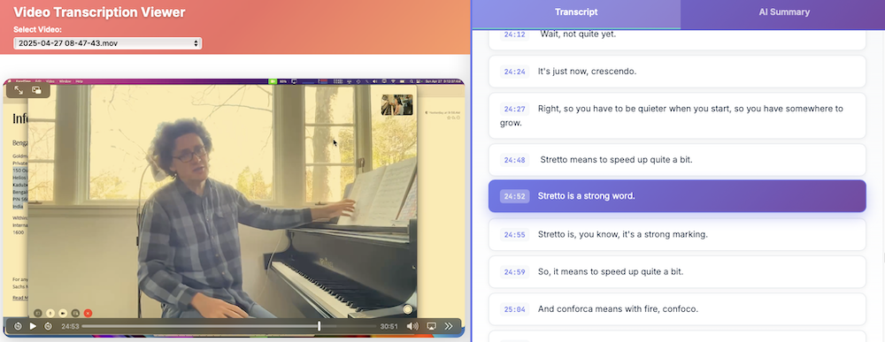
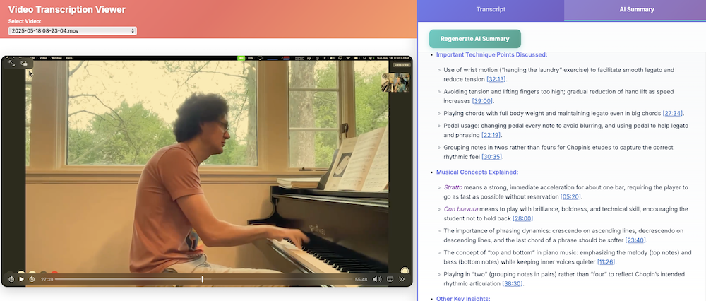

# Lesson Transcriber

A Python web application that transcribes video files using WhisperX and provides an interactive React frontend for viewing videos with synchronized, clickable transcripts and AI-powered summaries.

## Screenshots





*The application interface showing video playback with synchronized transcript and AI summary panels*

## Features

- **Audio Transcription**: Uses WhisperX with small model for efficient transcription
- **Speaker Diarization**: Identifies different speakers in the audio
- **Interactive Web Interface**: Native ES modules React frontend with video player and clickable transcript
- **Responsive Design**: Mobile-optimized layout with vertical flow and sticky video player
- **Time Synchronization**: Click transcript segments to jump to specific video timestamps
- **Real-time Highlighting**: Transcript highlights current segment as video plays
- **AI Summaries**: Generate piano lesson summaries using OpenAI GPT-4o-mini
- **Switchable Sidebar**: Toggle between transcript and summary views
- **Smart Video Sorting**: Videos sorted by date with special handling for test files (prefixed with "_")
- **Auto-Selection**: Automatically loads most recent video on page load
- **No Build Process**: Frontend uses native ES modules, no npm build required

## Project Structure

```
lesson-transcriber/
├── videos/              # Video files (configurable via VIDEO_DIR)
├── transcripts/         # Generated transcripts (JSON, TSV, SRT, VTT, TXT)
├── summaries/           # AI-generated summaries
├── static/              # Native ES modules frontend
│   ├── index.html       # Main HTML entry point
│   ├── js/              # React components as ES modules
│   │   ├── App.js
│   │   └── components/
│   └── css/
│       └── styles.css
├── app.py              # Flask backend server
├── transcribe_latest.sh # WhisperX transcription script
├── dev-no-build.sh     # Development server script
├── .env                # Environment variables
└── requirements.txt    # Python dependencies
```

## Setup

### Quick Start

1. **Configure Environment**: Create a `.env` file:
```bash
VIDEO_DIR=/path/to/your/videos
OPENAI_API_KEY=sk-proj-your-key-here
```

2. **Run Development Server**: 
```bash
./dev-no-build.sh
```

This script automatically:
- Sets up Python virtual environment
- Installs dependencies
- Starts Flask server with auto-reload
- Serves frontend directly (no build required)

The application runs on `http://localhost:5001`

### Manual Setup

1. **Install Dependencies**:
```bash
python3 -m venv venv
source venv/bin/activate
pip install -r requirements.txt
```

2. **Place Videos**: Put video files in the directory specified by `VIDEO_DIR`

3. **Run Server**:
```bash
python app.py
```

## Usage

1. **Add Videos**: Place video files (MP4, MOV, AVI, MKV, WebM, FLV) in your `VIDEO_DIR`

2. **Generate Transcripts**: Use the bash script to transcribe videos:
```bash
./transcribe_latest.sh           # Transcribe latest video
./transcribe_latest.sh --dry-run # Preview what would be transcribed
```

3. **Select Video**: Most recent video auto-loads, or use dropdown to select manually
   - Videos sorted by date (newest first)
   - Test files (prefixed with "_") appear at bottom
   - Prefers MP4 over MOV for better compatibility

4. **View & Navigate**: 
   - **Desktop**: Video on left, sidebar on right
   - **Mobile**: Vertical layout (header → video → sidebar)
   - **Tall Mobile Screens**: Video stays sticky at top while scrolling
   - Switchable sidebar shows transcript or AI summary
   - Click transcript segments to jump to timestamps
   - Current segment highlights as video plays

5. **Generate Summaries**: Click "Generate AI Summary" for piano lesson analysis
   - Structured summaries with key takeaways
   - Practice recommendations and areas to work on
   - Markdown formatting for better readability

## Components

### Backend (`app.py`)
- Flask server with CORS support
- REST API endpoints for videos, transcripts, and summaries
- Video file serving with range request support
- OpenAI integration for AI summary generation
- Configurable video directory via environment variables

### Transcription (`transcribe_latest.sh`)
- WhisperX integration with small model for efficiency
- Automatic processing of latest video files
- Multiple output formats (JSON, TSV, SRT, VTT, TXT)
- Speaker diarization and word-level timestamps

### Frontend Components (Native ES Modules)
- **App.js**: Main application state, sidebar management, and auto-video selection
- **VideoSelector**: Smart video dropdown with reverse chronological sorting
- **VideoPlayer**: Optimized HTML5 player with React.memo
- **SidebarPanel**: Tabbed interface for transcript/summary switching
- **TranscriptPanel**: Scrollable transcript with auto-follow
- **SummaryPanel**: AI summary display with react-markdown
- **StatusMessage**: User feedback and loading states
- **videoUtils.js**: Shared video sorting utility for consistent ordering

## API Endpoints

- `GET /api/videos` - List available videos with transcript status
- `GET /api/transcript/<video_name>` - Get transcript JSON for a video
- `GET /api/summary/<video_name>` - Get AI summary for a video
- `POST /api/generate-summary/<video_name>` - Generate new AI summary
- `GET /videos/<filename>` - Serve video files with range support

## Dependencies

### Python
- Flask & Flask-CORS
- Requests (for OpenAI API)
- Pandas (for TSV processing)
- Python-dotenv (for environment variables)
- WhisperX (for transcription)

### JavaScript (CDN via Import Maps)
- React & React DOM (esm.sh)
- React-Markdown (esm.sh)
- No build tools or bundlers required

## Environment Variables

- `VIDEO_DIR`: Path to video files directory (supports spaces in paths)
- `OPENAI_API_KEY`: OpenAI API key for AI summary generation

## Notes

- GPU acceleration recommended for faster transcription
- Frontend uses native ES modules - no build process required
- Responsive design optimized for both desktop and mobile viewing
- Transcript files cached in multiple formats in `transcripts/` folder
- AI summaries optimized for piano lesson content
- Video serving supports range requests for smooth playback
- Application prefers MP4 files over MOV for better browser compatibility
- Test files (prefixed with "_") automatically sorted to bottom and excluded from auto-selection